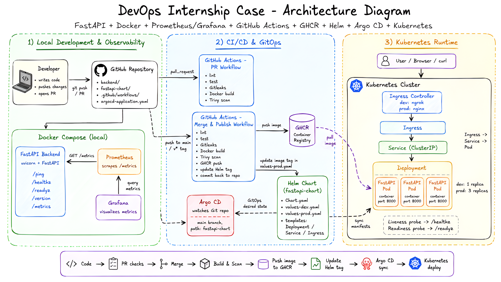

# FastAPI DevOps Case

Bu proje, FastAPI ile yazılmış küçük bir backend servisinin lokal geliştirme, test, container build, gözlemlenebilirlik, CI/CD, Helm ve Argo CD ile Kubernetes dağıtımı adımlarını kapsayan bir DevOps case çalışmasıdır.

## Seçilen Track

Seçilen track: **DevOps / Platform track**.

Bu track kapsamında uygulama kodunun çalıştırılmasının yanında aşağıdaki DevOps pratikleri uygulanmıştır:

- Docker ile container image üretimi
- Docker Compose ile lokal servis orkestrasyonu
- Prometheus metrikleri ve Grafana ile gözlemlenebilirlik
- GitHub Actions ile lint, test, secret scan, image scan ve image publish akışı
- Helm chart ile Kubernetes manifest yönetimi
- Argo CD ile GitOps tabanlı deployment

## Proje Yapısı

```text
.
├── .github/
│   └── workflows/
│       ├── merge.yaml
│       └── pr.yaml
├── argocd-application.yaml
├── backend/
│   ├── app/
│   │   └── main.py
│   ├── tests/
│   │   └── test_main.py
│   ├── Dockerfile
│   ├── docker-compose.yaml
│   ├── prometheus.yaml
│   └── requirements.txt
├── docs/
│   └── images/
│       └── architecture-diagram.png
├── fastapi-chart/
│   ├── templates/
│   │   ├── Deployment.yaml
│   │   ├── Ingress.yaml
│   │   └── Service.yaml
│   ├── Chart.yaml
│   ├── values-dev.yaml
│   └── values-prod.yaml
├── README.md
├── RUNBOOK.md
└── SECURITY.md
```

## Architecture Diagram

```text
docs/images/architecture-diagram.png
```



## Operasyon ve Güvenlik Dokümanları

- [RUNBOOK.md](RUNBOOK.md): Restart, rollback, log bakma ve incident sonrası kontrol adımları.
- [SECURITY.md](SECURITY.md): Secret rotation, secret leak müdahalesi ve güvenlik notları.

## Mimari Notlar

Uygulama `backend/app/main.py` içinde tanımlı bir FastAPI servisidir. Servis `uvicorn` ile `8000` portunda çalışır ve Prometheus metriklerini `/metrics` endpoint'i üzerinden yayınlar.

Temel akış:

```text
Client
  -> Ingress
  -> Kubernetes Service
  -> FastAPI Pod
  -> /healthz, /readyz, /metrics
```

Lokal gözlemlenebilirlik akışı:

```text
FastAPI /metrics
  -> Prometheus
  -> Grafana
```

CI/CD ve GitOps akışı:

```text
Pull Request
  -> lint
  -> test
  -> GitLeaks secret scan
  -> Docker build
  -> Trivy image scan

main branch push
  -> lint/test/scan
  -> Docker image build
  -> GHCR push
  -> Helm chart image tag update
  -> Argo CD sync
  -> Kubernetes deployment
```

Kubernetes tarafında Helm chart şu kaynakları üretir:

- `Deployment`: FastAPI container'ını çalıştırır.
- `Service`: Pod'lara cluster içinden erişim sağlar.
- `Ingress`: Dış erişim için host/path yönlendirmesi sağlar.

Health check ayarları Helm values dosyalarından yönetilir:

- Liveness probe: `/healthz`
- Readiness probe: prod ortamında `/readyz`

## Uygulama Endpointleri

| Endpoint       | Açıklama                                        |
| -------------- | ----------------------------------------------- |
| `GET /ping`    | Basit kontrol endpoint'i. `"pong"` döner.       |
| `GET /healthz` | Liveness probe için sağlık durumunu döner.      |
| `GET /readyz`  | Readiness probe için hazır olma durumunu döner. |
| `GET /version` | Uygulama versiyonunu döner.                     |
| `GET /metrics` | Prometheus metriklerini yayınlar.               |

## Gereksinimler

Lokal geliştirme için:

- Python 3.12+
- Docker
- Docker Compose

Kubernetes dağıtımı için:

- Kubernetes cluster: Minikube, Kind veya mevcut bir cluster
- Helm 3
- Ingress controller: dev için `ngrok`, prod örneği için `nginx` (bu sadece örnek olarak)
- Argo CD: GitOps dağıtımı için

CI/CD için:

- GitHub Actions
- GHCR package publish izni
- Repository `GITHUB_TOKEN` yetkileri

## Kurulum

Python sanal ortamını oluşturup bağımlılıkları yükle:

```bash
cd backend
python -m venv .venv
source .venv/bin/activate
pip install -r requirements.txt
```

Testleri çalıştır:

```bash
pytest -q
```

Uygulamayı lokal çalıştır:

```bash
uvicorn app.main:app --reload
```

Kontrol:

```bash
curl http://127.0.0.1:8000/ping
curl http://127.0.0.1:8000/healthz
curl http://127.0.0.1:8000/readyz
curl http://127.0.0.1:8000/version
```

## Çalıştırma

### Lokal Python

```bash
cd backend
source .venv/bin/activate
uvicorn app.main:app --host 0.0.0.0 --port 8000 --reload
```

Uygulama adresi:

```text
http://localhost:8000
```

### Docker

Image build:

```bash
docker build -t fastapi-backend:latest ./backend
```

Container çalıştırma:

```bash
docker run --rm -p 8000:8000 fastapi-backend:latest
```

Build SHA değeri vermek istersen:

```bash
docker build --build-arg BUILD_SHA=$(git rev-parse HEAD) -t fastapi-backend:latest ./backend
```

### Docker Compose

FastAPI, Prometheus ve Grafana servislerini birlikte başlat:

```bash
cd backend
docker compose up --build
```

Servis adresleri:

| Servis     | Adres                   |
| ---------- | ----------------------- |
| FastAPI    | `http://localhost:8000` |
| Prometheus | `http://localhost:9090` |
| Grafana    | `http://localhost:3000` |

Prometheus konfigürasyonu `backend/prometheus.yaml` içindedir ve FastAPI servisinin `/metrics` endpoint'ini scrape eder.

### Helm ile Kubernetes

Dev ortamı için image repository `fastapi-backend`, tag `latest`, pull policy `Never` olarak ayarlanmıştır. Minikube kullanıyorsan image'ı cluster içinde build edebilirsin:

```bash
minikube image build -t fastapi-backend:latest ./backend
```

Dev deployment:

```bash
helm upgrade --install fastapi-dev ./fastapi-chart -f fastapi-chart/values-dev.yaml
```

Prod benzeri deployment:

```bash
helm upgrade --install fastapi-prod ./fastapi-chart -f fastapi-chart/values-prod.yaml
```

Servise port-forward ile erişmek için:

```bash
kubectl port-forward svc/fastapi-dev-service 8080:80
```

Kontrol:

```bash
curl http://127.0.0.1:8080/healthz
```

Kaldırma:

```bash
helm uninstall fastapi-dev
```

### Argo CD ile GitOps

`argocd-application.yaml`, Argo CD Application kaynağını tanımlar. Kaynak repo olarak GitHub repository'sini, path olarak `fastapi-chart`, values dosyası olarak `values-prod.yaml` kullanır.

Argo CD kurulu bir cluster'da uygulamak için:

```bash
kubectl apply -f argocd-application.yaml
```

Application ayarları:

- Argo CD namespace: `argocd`
- Hedef namespace: `default`
- Target revision: `main`
- Sync policy: automated sync, prune ve self-heal açık

## Ortam Değişkenleri ve Konfigürasyon

Uygulama runtime sırasında zorunlu bir `.env` dosyası okumaz. Konfigürasyonun büyük bölümü Docker, Docker Compose, Helm values ve GitHub Actions üzerinden yönetilir.

| Değişken / Alan      | Kullanıldığı Yer                      | Açıklama                                                                    | Varsayılan / Örnek                                                        |
| -------------------- | ------------------------------------- | --------------------------------------------------------------------------- | ------------------------------------------------------------------------- |
| `BUILD_SHA`          | `backend/Dockerfile`, CI Docker build | Image build sırasında commit SHA bilgisini container environment'ına koyar. | `local`                                                                   |
| `image.repository`   | Helm values                           | Kubernetes deployment için image repository.                                | dev: `fastapi-backend`, prod: `ghcr.io/dogrueymen/devops-internship-case` |
| `image.tag`          | Helm values                           | Kubernetes deployment için image tag.                                       | dev: `latest`, prod: chart ile güncellenen versiyon tag'i                 |
| `image.pullPolicy`   | Helm values                           | Kubernetes image pull davranışı.                                            | dev: `Never`, prod: `IfNotPresent`                                        |
| `replicaCount`       | Helm values                           | Çalışacak pod sayısı.                                                       | dev: `1`, prod: `3`                                                       |
| `service.port`       | Helm values                           | Kubernetes Service portu.                                                   | `80`                                                                      |
| `service.targetPort` | Helm values                           | Container target portu.                                                     | `8000`                                                                    |
| `containerPort`      | Helm values                           | FastAPI container portu.                                                    | `8000`                                                                    |
| `ingress.enabled`    | Helm values                           | Ingress kaynağını açar/kapatır.                                             | `true`                                                                    |
| `ingress.className`  | Helm values                           | Kullanılacak ingress class.                                                 | dev: `ngrok`, prod: `nginx`                                               |
| `ingress.host`       | Helm values                           | Dış erişim host değeri.                                                     | dev/prod values içinde tanımlı                                            |
| `GITHUB_TOKEN`       | GitHub Actions                        | GitLeaks action, GHCR login ve repository push işlemlerinde kullanılır.     | GitHub tarafından sağlanır                                                |
| `IMAGE_TAG`          | GitHub Actions merge workflow         | Helm chart image tag güncelleme adımında kullanılır.                        | Workflow içinde üretilir                                                  |

Helm ortamlarını düzenlemek için:

- Dev ayarları: `fastapi-chart/values-dev.yaml`
- Prod ayarları: `fastapi-chart/values-prod.yaml`

## CI/CD

Pull request workflow'u `.github/workflows/pr.yaml` içinde tanımlıdır ve şu kontrolleri çalıştırır:

- Python 3.12 kurulumu
- Bağımlılık kurulumu
- Ruff lint
- Pytest
- GitLeaks secret scan
- Docker image build
- Trivy HIGH/CRITICAL image scan

Merge/publish workflow'u `.github/workflows/merge.yaml` içinde tanımlıdır. `main` branch push veya `v*` tag push ile tetiklenir ve PR kontrollerine ek olarak:

- GHCR image tag metadata üretir
- Docker image'ı SHA ve version tag ile build eder
- Image'ı GHCR'a push eder
- `main` branch push sonrası Helm chart `appVersion` ve prod image tag değerini günceller
- Değişiklik varsa chart güncellemesini repository'ye commit eder

## Gözlemlenebilirlik

FastAPI metrikleri `prometheus-fastapi-instrumentator` ile expose edilir.

Metrik endpoint'i:

```text
http://localhost:8000/metrics
```

Prometheus scrape ayarı:

```yaml
scrape_configs:
  - job_name: "fastapi-backend"
    metrics_path: /metrics
    static_configs:
      - targets: ["fastapi-backend:8000"]
```

Grafana, Docker Compose içinde Prometheus'a bağlanarak dashboard oluşturmak için kullanılabilir.
